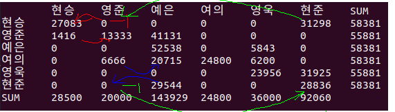

### 돌다 보면 답이 나올 꺼다 알고리즘

보내야 할 계좌이체가 2개 이상인 사람의 항목중, 가장 작은 것을 선택

1) 무조건 자신한테 돈을 보냄

2) canceler moveto 항목이 0이 아닌 것을 선택

2-1) canceler movefrom 항목이 값보다 크면 BEST

2-2) 값이 크지 않아도 마이너스 값을 입력하고 보냄

일단 보내야 하는 항은 하나 없어지고, 마이너스 항이 하나 생김, 마이너스 항은 좋은것

### 오?

일단 남은 계좌이체를 모두 본인한테 보냄

플러스 항, 마이너스 항이 생기는 것 상관하지 말고 다 보냄

**그리고 다시 플러스항, 마이너스 항을 고려한 알고리즘을 다시 돌림**

일단 지금까지 한 내용을 정리하고,

정산 페이지를 만들고 다시 알고리즘으로 돌아오자